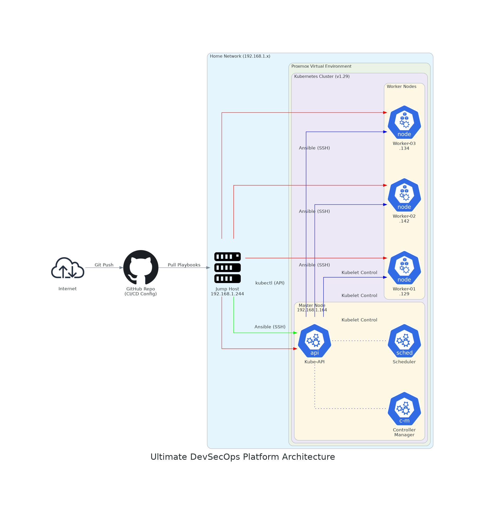

# Ultimate DevSecOps Platform Architecture

## System Description
This project demonstrates a comprehensive, end-to-end DevSecOps platform built around microservices, Infrastructure as Code (IaC), GitOps, and robust security practices. The application consists of a React/Vite frontend and a Python backend interacting with a Redis database. The infrastructure is primarily deployed on a local Proxmox Kubernetes cluster (v1.29) utilizing Terraform and Ansible, with secure internal networking provided by Tailscale.

## Architecture Diagram


## CI/CD Flow
The CI/CD pipeline implements a strict separation between Continuous Integration (Jenkins) and Continuous Deployment (Argo CD).

**Continuous Integration (Jenkins):**
Each microservice contains a `Jenkinsfile`. The generic pipeline performs the following steps:
1. **Checkout**: Pulls the latest source code from Git.
2. **Build Docker Image**: Containerizes the application.
3. **Push to Docker Hub**: Uploads the image to the remote registry.
4. **GitOps Update**: Updates the Kubernetes deployment manifest (`deployment.yaml`) in the main Git repository with the newly generated image tag and pushes the change automatically.

**Continuous Deployment (GitOps with Argo CD):**
Argo CD continuously monitors the Git repository. When Jenkins pushes the updated manifest to the `main` branch, Argo CD detects the change and automatically synchronizes the new desired state to the live Kubernetes cluster.

## Configuration Management
Configuration management is handled at multiple levels ensuring consistency:
- **Terraform & Ansible**: Used to provision the Proxmox VMs and configure the Kubernetes cluster (Infrastructure as Code).
- **Secrets Management**: Sensitive data such as the Redis password is injected dynamically into pods using Kubernetes `Secret` resources (`secretKeyRef`).

## Security Decisions (DevSecOps)
- **Non-root Containers**: Docker images (e.g., the backend API) run as a dedicated non-root user (`appuser`) to limit the potential blast radius.
- **Minimal Base Images**: Using lightweight base images (e.g., `python:3.9-slim`, `node:20-alpine`) reduces the attack surface.
- **Tailscale Mesh VPN**: Instead of exposing the cluster directly to the internet via public LoadBalancers, Tailscale is used to securely expose the internal services. The Kubernetes services use `loadBalancerClass: tailscale`, making them accessible only to authenticated devices on the private Tailnet.
- **Shift-Left Security**: Integration of container image scanning and static analysis in the Jenkins pipeline (Work in Progress).

## Run Instructions

### Prerequisites
- Proxmox Virtual Environment
- Terraform & Ansible installed locally
- Docker Hub credentials configured in Jenkins

### Setup Steps
1. **Infrastructure Provisioning**:
   ```bash
   cd infrastructure/terraform/proxmox
   terraform init
   terraform apply -auto-approve
   ```

2. **Kubernetes Cluster Setup**:
   ```bash
   cd ../../ansible
   ansible-playbook -i inventory.ini playbook-k8s-setup.yaml
   ```

3. **Deploy Applications (GitOps)**:
   Once Argo CD is installed on the cluster, apply the `AppProject` and `Application` manifests from `apps/argocd/` to instruct Argo to track this repository and continuously deploy the `devops-dev` and `devops-prod` environments.
